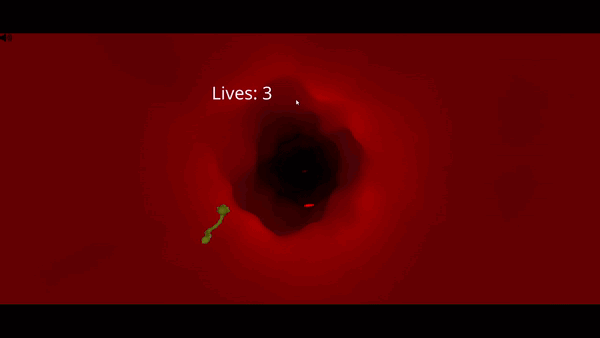

# Pathogen-Surge

## What is it ?

In this project you are a virus that chooses which area of the human body you want to infect. You will then have to cross blood vessels in a relentless race to try and infest a vital organ. This game is intended to be educational, and at the end of the race (if you succeed) you will be able to see the organ in 3D with a brief description of its function.

## Where to play ?

**The website is quite low to load because of model weight !**

https://lecaribooo.github.io/Pathogen-Surge/

## Members and work done

Yoan BIGGIO:

- Sound
- Virus, vessel and red blood cell model in blender
- Blood cell animations (rotation + particle effect)
- Game Over Scene
- Pause System
- AR system (pause, and game over that does not work)

Pierre-Alexis VALBRUN:

- Movements of the player
- Scene management
- Menu scene
- End scene
- Deployment
- AR system (Menu, game, end scenes)

## Sources

You can find here all the sources for the model we used:

- `angiology.glb`: "Angiology" (https://skfb.ly/ooZKv) by Z-Anatomy is licensed under Creative Commons Attribution-ShareAlike (http://creativecommons.org/licenses/by-sa/4.0/).
- `arthrology.glb`: "Arthrology" (https://skfb.ly/ooYYC) by Z-Anatomy is licensed under Creative Commons Attribution (http://creativecommons.org/licenses/by/4.0/).
- `brain.glb`: "Brain" (https://skfb.ly/6wQ8I) by maheshshinde777 is licensed under Creative Commons Attribution (http://creativecommons.org/licenses/by/4.0/).
- `heart.glb`: "Realistic Human Heart" (https://skfb.ly/oyBCT) by neshallads is licensed under Creative Commons Attribution (http://creativecommons.org/licenses/by/4.0/).
- `intestine.glb`: "Small and large intestine" (https://skfb.ly/6SDn9) by antonia.sundberg is licensed under Creative Commons Attribution (http://creativecommons.org/licenses/by/4.0/).
- `liver.glb`: "Liver" (https://skfb.ly/6XnBD) by Errin Roy is licensed under Creative Commons Attribution (http://creativecommons.org/licenses/by/4.0/).
- `lungs.glb`: "Realistic Human Lungs" (https://skfb.ly/oBDWI) by neshallads is licensed under Creative Commons Attribution (http://creativecommons.org/licenses/by/4.0/).

And all sounds come from this website : https://www.zapsplat.com/